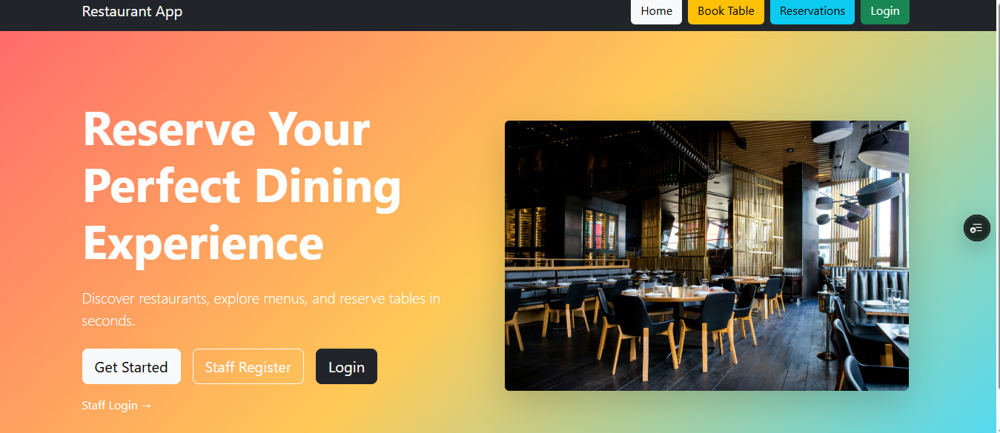
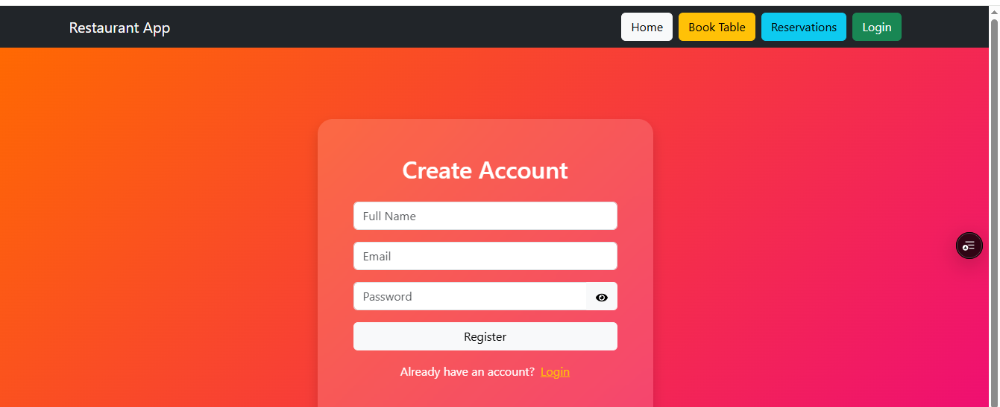
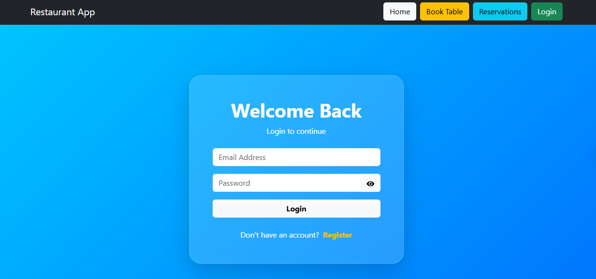
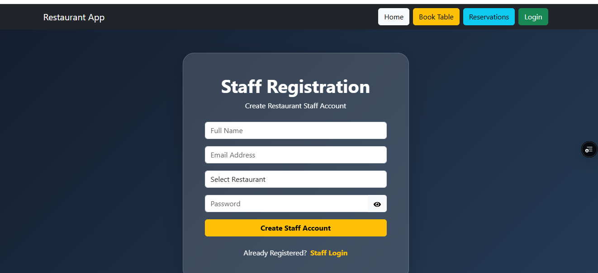
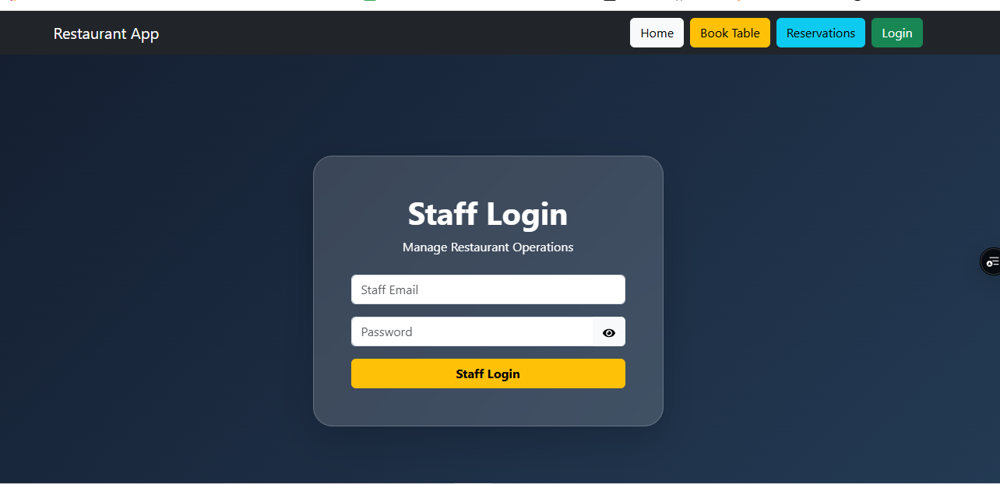

Restaurant Reservation System

A full-stack Restaurant Reservation System built using the MERN Stack. The application allows customers to browse restaurants, view menus, reserve tables, and manage reservations. Restaurant staff can manage restaurant operations through dedicated staff accounts.


## Live Demo

Frontend: https://rrs-w5.vercel.app

Backend:https://rrs-w5-1.onrender.com

Github Repository:https://github.com/kuppinedibhavani-dev/RRS_w5

## Images
  Home Page= 
  Customer Register Page= 
  Customer Login Page= 
  Staff Register Page=
  Staff Login Page= 
  
## Features

### Customer Features

* User Registration
* User Login
* Browse Restaurants
* View Restaurant Menus
* Book Tables
* View Reservations
* Responsive UI

### Staff Features

* Staff Registration
* Staff Login
* Restaurant Assignment
* Staff Dashboard
* Reservation Management

### Admin Features

* Restaurant Management
* Menu Management
* Reservation Tracking

## Tech Stack

### Frontend

* React.js
* Vite
* React Router DOM
* Axios
* Bootstrap
* React Icons

### Backend

* Node.js
* Express.js
* MongoDB Atlas
* Mongoose
* JWT Authentication
* bcryptjs

## Project Structure

Restaurant Reservation System

backend/
├── src/
│   ├── config/
│   ├── controllers/
│   ├── middleware/
│   ├── models/
│   ├── routes/
│   └── server.js

frontend/
├── src/
│   ├── components/
│   ├── context/
│   ├── pages/
│   ├── services/
│   ├── App.jsx
│   └── main.jsx

## Database Collections

### Users

* name
* email
* password
* role

### Staff

* name
* email
* password
* restaurantId

### Restaurants

* name
* location
* phone
* description
* image

### Menus

* restaurantId
* itemName
* category
* description
* price
* image

### Reservations

* userId
* restaurantId
* date
* time
* guests

## API Endpoints

### Authentication

POST /api/auth/register

POST /api/auth/login

POST /api/auth/staff-register

POST /api/auth/staff-login

GET /api/auth/profile

### Restaurants

GET /api/restaurants

GET /api/restaurants/:id

POST /api/restaurants

PUT /api/restaurants/:id

DELETE /api/restaurants/:id

### Menus

GET /api/menus

GET /api/menus/:id

GET /api/menus/restaurant/:restaurantId

POST /api/menus

PUT /api/menus/:id

DELETE /api/menus/:id

### Reservations

GET /api/reservations

POST /api/reservations

## Installation

### Backend Setup

```bash
cd backend
npm install
npm run dev
```

### Frontend Setup

```bash
cd frontend
npm install
npm run dev
```

## Environment Variables

Create a .env file in the backend directory:

```env
PORT=5000
MONGO_URI=your_mongodb_connection_string
JWT_SECRET=your_secret_key
```

## Deployment

### Frontend

* Vercel

### Backend

* Render

### Database

* MongoDB Atlas

## Screenshots

* Landing Page
* User Registration
* User Login
* Staff Registration
* Staff Login
* Restaurant Listing
* Menu Browsing
* Reservation Page
* Dashboard

## Future Enhancements

* Online Payments
* Email Notifications
* Reservation Cancellation
* Restaurant Ratings & Reviews
* Admin Dashboard
* Table Availability Management
* Food Ordering System

